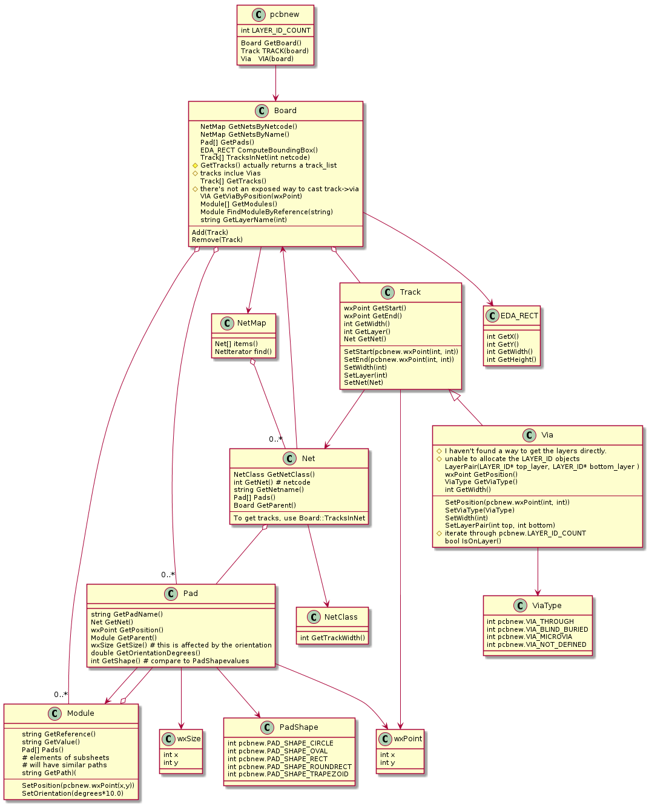

# kicad_mmccoo

Kicad's pcbnew has a built in python engine for automating tasks. Unfortunately, this scripting interface is not documented anywhere that I've been able to find. 

This is a repository to hold example and utility code in the hopes that others can learn to write their own scripts.

I have a [companion blog](https://kicad.mmccoo.com/)

If you get nothing else out of this repository, take a look at this UML diagram. It doesn't contain all available APIs; just the ones needed to do common tasks (the spec from which it was generated is in the plantuml subdirectory)

# plugins
This repo also contains a bunch of plugins, a description of which can be found in this youtube vide:

## plugin install
For linux... create a directory in your homedir called .kicad_plugins
Inside of that directory either clone this repo or link to a clone of it.

## additional python packages are needed
    # To get the dxf related plugins to work on linux systems, you'll need something like this:
    # Make sure pip is available
    sudo python2.7 -m ensurepip --default-pip
    #  or
    sudo apt install python-pip

    # then these 
    sudo pip2 install --upgrade pip
    sudo pip2 install dxfgrabber
    sudo pip2 install numpy
    sudo pip2 install scipy
    sudo pip2 install shapely